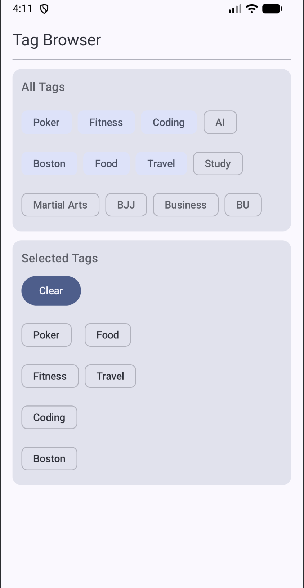

# CS501 HW3 - Q3 FlowRow / FlowColumn: Tag Browser + Filters

This app implements a "Tag Browser" screen for the Q3 FlowRow / FlowColumn assignment. It demonstrates dynamic chip layouts using Jetpack Compose's FlowRow and FlowColumn, interactive tag selection, and Material 3 components.

## How to run
- Open the project in Android Studio
- Run the app on an emulator or device

## Assignment Requirements & Implementation

### Layout & Behavior
- **Tag Browser:** Uses a FlowRow to display a dynamic list of tags as FilterChips that wrap horizontally across the screen.
- **Selected Tags:** Uses a FlowColumn to show selected tags as AssistChips, stacking them into multiple columns as needed.
- **Interaction:** Tapping a tag chip toggles its selection. The "Selected Tags" area updates in real time. A "Clear" button removes all selections.

### Material 3 Components Used (6+):
- FilterChip (for tag selection)
- AssistChip (for selected tags)
- Card (for grouping sections)
- Button (for clear/reset)
- HorizontalDivider (for section separation)
- Text (for headers and labels)

### Modifier Usage
- Consistent spacing with `Arrangement.spacedBy(...)` in both FlowRow and FlowColumn.
- Responsive sizing using `fillMaxWidth()`, `wrapContentHeight()`, and `padding`.
- Visual selected state: FilterChip and AssistChip show selection with color/elevation changes.

### Other Notes
- The UI is built with clear separation between all tags and selected tags.
- State is managed using Compose's `remember` and `mutableStateListOf`.
- The design is responsive and visually clear for both small and large screens.

## Screenshots

## AI Disclosure
AI tools were used to help debug issues with FlowRow and FlowColumn, interpret Compose and Material 3 requirements, and troubleshoot layout and state management problems. AI also guided me through the process of opting in to experimental Compose APIs and editing Gradle dependencies and configuration to enable the necessary libraries and features. No code was directly copied from AI output; all code was written and adapted by me, but AI played a role in problem-solving, debugging, and clarifying assignment requirements.